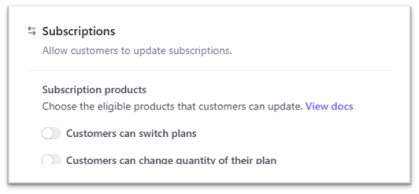
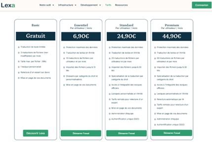
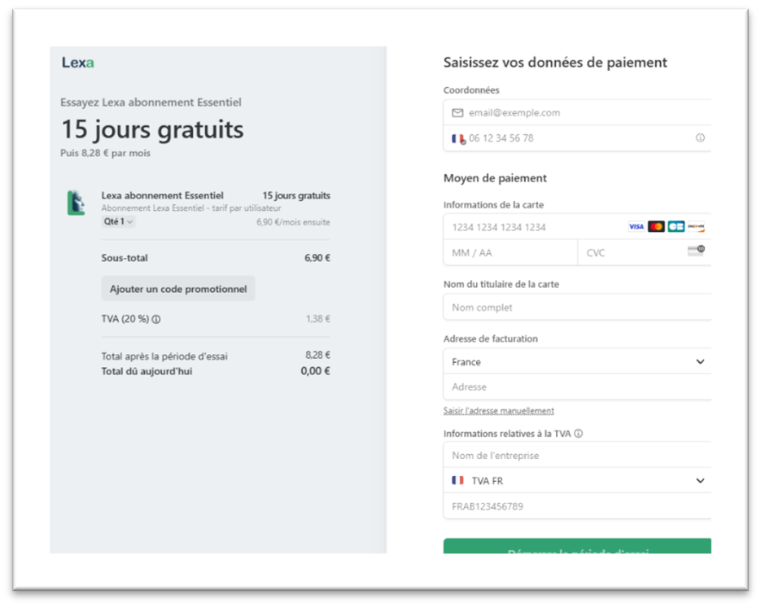
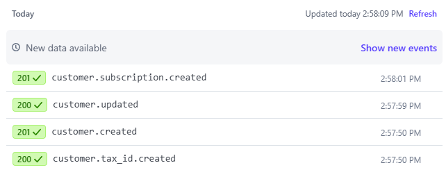

# 1. Introduction

Ce document vise à fournir un aperçu complet de l'intégration entre le portail **LEXAMT** et **STRIPE**, le service de traitement de paiements en ligne. Il détaille les aspects fonctionnels et techniques de cette intégration, offrant des explications sur la façon dont les deux systèmes collaborent pour permettre aux utilisateurs une expérience de paiement en ligne fluide et sécurisée.

## 1.1 Objectif du document

Plus précisément, ce document va :

- Décrire le parcours utilisateur de paiement, de la sélection du service à la finalisation du paiement.
- Expliquer l’architecture technique de l’intégration, incluant l’utilisation des API de **STRIPE** et les capacités backend de `Django`.
- Aborder les considérations de sécurité liées à ce contexte de paiement.

# 2. Aperçu de la situation actuelle du portail **LEXAMT**

L’intégration entre **LEXAMT** et **STRIPE** est aujourd’hui manuelle. La création de l’utilisateur et l’enregistrement de ses informations d’abonnement sont réalisés manuellement après deux événements distincts :

## 2.1 L’utilisateur choisit de s’abonner sur le portail https://lexamt.fr

- Ce canal de vente est appelé dans la suite du document le canal d’inscription en ligne.
- L’utilisateur paie sur le portail **STRIPE**.

Dans ce parcours d’abonnement :

- La période de renouvellement est toujours mensuelle.
- Le type d’abonnement est identique pour une transaction.
- Si différents types d’abonnement sont nécessaires, plusieurs transactions seront réalisées.
- La création de la société , de l'utilisateur et des abonnements est automatique.

## 2.2 Une entreprise signe un contrat de licence

Une entreprise décide de signer un contrat de licence pour accéder aux services **LEXAMT** pour un certain nombre de ses employés. Le paiement se fait par factures. Ce canal de vente est appelé dans la suite du document le canal d’inscription hors ligne. Après l’enregistrement du contrat, le super utilisateur reçoit les informations suivantes :

- Nom de la société.
- Nom de l’administrateur.
- Date de signature.
- Durée du contrat.
- L’entreprise peut souscrire à différents types d’abonnement avec différentes quantités de licences, par exemple :
  - Société A a souscrit :
    - 10 licences "essential".
    - 20 licences "standard".
- L’administrateur principal de **LEXAMT** enregistre le contrat en :
  - Créant pour chaque lot de licences :
    - Un groupe d’abonnement
    - Un groupe d’utilisateurs.
    - Une liste d’utilisateurs avec nom, prénom, email
    - Capacité d’administration
- L’administrateur envoie une invitation à chaque utilisateur pour finaliser l’inscription, y compris la définition de son mot de passe.

## 2.3 Contexte de l’intégration avec **STRIPE**

### 2.3.1 Présentation de STRIPE

Les services **STRIPE** couvrent toutes les fonctionnalités suivantes :

- Abonnement en ligne avec méthode de paiement.
- Processus d’annulation d’abonnement.
- Gestion de la facturation et des taxes par pays.
- Historique des factures.
- Portail client avec :
  - Méthode de paiement enregistrée.
  - Informations de facturation.
  - Historique des factures.
  - Bouton d’annulation.

Remarque 1 : Le changement de plan est possible par paramétrage, la modification de la quantité du plan est possible par paramétrage. 

Figure 1 - Paramètres pour les produits d’abonnement

### 2.3.2 Abonnement en ligne avec **STRIPE**

D’après la description ci-dessus, l’intégration **STRIPE** sera utilisée uniquement pour les processus d’abonnement en ligne.

Figure 2 - Abonnement en ligne

Figure 3 - Paiement en ligne

# 3. Intégration **STRIPE** et **LEXAMT**

## 3.1 Objectif

L’intégration vise à automatiser les processus d’abonnement et de paiement, en éliminant la saisie manuelle et en effectuant une synchronisation en temps réel des informatiosn entre les deux portails. L’objectif est d’inclure le contenu **STRIPE** dans le contenu de portail.lexamt.fr (l’inverse n’est pas vrai ; les utilisateurs ajoutés après la signature d’un contrat n’ont pas à être présents dans **STRIPE**).

L’intégration optimise les ressources en réduisant les tâches manuelles pour les administrateurs, permet un suivi précis des transactions et diminue les coûts opérationnels liés au traitement des paiements et aux erreurs potentielles.

## 3.2 Aspects techniques de l’intégration

La stratégie repose sur l’utilisation des webhooks **STRIPE** pour notifier portail.lexamt.fr des événements liés aux paiements et abonnements. Chaque événement déclenche une action spécifique dans l’application Django pour maintenir la cohérence des données.

### 3.2.1 Configuration du Webhook STRIPE

Un endpoint webhook est configuré dans **STRIPE** pour envoyer des notifications à portail.lexamt.fr.

Les événements **STRIPE** traités pour cette intégration sont :

- `customer.created`
- `customer.updated`
- `customer.subscription.created`
- `customer.subscription.updated`
- `customer.subscription.deleted`
- `customer.subscription.trial_will_end`
- `customer.tax_id.created`

### 3.2.2 Description des événements et actions associées

Un test dans la configuration du portail [lexammt.com](https://lexamt.com/en/tarifs-preprod/) permet de constater la séquence des évènements lors d'un souscription, émis par le `webhook` présentés ici dans l'ordre inverse d'arrivée, il est à noter que l'ordre de cette séquence peut différer d'une insciption à l'autre et qu'elle est différente si la souscription est faite par une entreprise ou pas (case à cocher "je suis une entreprise"). Dans le cas d'une souscription personnelle l'event `customer.tax_id.created` n'est pas généré :

Figure 4 - liste des évenements reçus .

Le tableau ci-dessous décrit tous les événements écoutés de **STRIPE** et le statut reçu par le `webhook`. L’ajout de ces deux informations donne la liste des actions à effectuer par **LEXAMT** pour maintenir la cohérence entre les bases de données **STRIPE** et **LEXAMT**.

| Event ID | **Status Sent to Webhook** | **Functional Case** | **Action Category** |
|----------|----------------------------|---------------------|---------------------|
| `customer.subscription.created` | `INCOMPLETE` | Nouvel abonnement créé, en attente du paiement initial | [P](#3231-categorie-daction-p--abonnement-en-attente) |
| `customer.subscription.created` | `TRIALING`   | Nouvel abonnement avec période d’essai démarrée | [T](#3234-categorie-daction-t--abonnement-en-essai) |
| `customer.subscription.created` | `ACTIVE`     | Nouvel abonnement créé avec activation immédiate | [A](#3232-categorie-daction-a--abonnement-actif) |
| `customer.subscription.updated` | `ACTIVE`     | Abonnement activé après paiement, changement de plan ou réactivation | [B](#3233-categorie-daction-b--abonnement-mis-à-jour) |
| `customer.subscription.updated` | `TRIALING`   | Abonnement passé en période d’essai | [T](#3234-categorie-daction-t--abonnement-en-essai) |
| `customer.subscription.updated` | `PAST_DUE`   | Paiement échoué mais abonnement encore actif en période de grâce | [G](#3235-categorie-daction-g--periode-de-grace) |
| `customer.subscription.updated` | `UNPAID`     | Période de grâce terminée après plusieurs échecs de paiement | [U](#3236-categorie-daction-u--abonnement-impaye) |
| `customer.subscription.updated` | `INCOMPLETE_EXPIRED` | Fenêtre de paiement initial expirée sans paiement réussi | [E](#3238-categorie-daction-e--incomplet-expire) |
| `customer.subscription.deleted` | `CANCELED`   | Abonnement annulé | [C](#3239-categorie-daction-c--abonnement-annule) |
| `customer.subscription.trial_will_end` | `TRIALING` | Fin de période d’essai imminente (3 jours avant la fin) | [W](#32311-categorie-daction-w--alerte-de-fin-dessai) |
| `customer.created`              | `N/A` | Création d'un client | [I](#32312-categorie-daction-i--informations-de-facture-paiement-donnees-utilisateur) |
| `customer.updated`              | `N/A` | Détails client mis à jour  | [K](#32312-categorie-daction-i--informations-de-facture-paiement-donnees-utilisateur) |
| `customer.tax_id.created`       | `N/A` | souscription par une entreprise  | [J](#32312-categorie-daction-i--informations-de-facture-paiement-donnees-utilisateur) |
| `customer.delete`               | `N/A` | Compte client supprimé de **STRIPE** | [X](#32313-categorie-daction-x--suppression-du-client) |

### 3.2.3 Catégories d’actions requises pour le portail LEXAMT lors de la réception des webhooks

#### 3.2.3.1 Catégorie d’action P : Abonnement en attente

Note : Dans la situation actuelle ce cas ne devrait pas se produire. Il est cependant géré.
- Création des souscriptions.  
- Une souscription est raccrochée à l'utilisateur acheteur, les autres souscriptions sont raccroché à des user crée sur l'insant. Ayant le nom de l'acheteur suivi de `_X`.
- Toutes les souscriptions ont le même `stripe_subscription_id`.
- Mise à jour du status des souscriptions à `INCOMPLETE` 
- Envoyer un email expliquant que le paiement est nécessaire aux administrateurs/acheteur.

#### 3.2.3.4 Catégorie d’action T : Abonnement en essai

- Création des souscriptions.  
- Une souscription est raccrochée à l'utilisateur acheteur, les autres souscriptions sont raccroché à des user crée sur l'insant. Ayant le nom de l'acheteur suivi de `_X`.
- Toutes les souscriptions ont le même `stripe_subscription_id`.
- Mise à jour du status de le souscription à `TRIALING`

#### 3.2.3.2 Catégorie d’action A : Abonnement actif

Note : Dans la situation actuelle ce cas ne devrait pas se produire. Il est cependant géré.

- Création des souscriptions.  
- Une souscription est raccrochée à l'utilisateur acheteur, les autres souscriptions sont raccroché à des user crée sur l'insant. Ayant le nom de l'acheteur suivi de `_X`.
- Toutes les souscriptions ont le même `stripe_subscription_id`.
- Mise à jour du status des souscriptions à `ACTIVE` 

#### 3.2.3.3 Catégorie d’action B : Abonnement mis à jour

Les informations modifiées sont récupérées en comparant la situation existante avec les infos fournies par STRIPE :

Les informations écoutées sont :

- La quantité de licences,
- La date de fin de la souscription,
- Le status de la souscription

| Type de changement | Actions |
|--------------------|---------|
| Changement de quantité        | - Augmentation du nombre de licences :    <li> Création des souscriptions utilisateurs supplémentaires avec le status fourni par `STRIPE`</li> - Diminution du nombre de licences :  <li> Passage du status des dernières licences à `TERMINATED`  Envoi d'un email de confirmation aux administrateurs.</li> |
| Le champ `current_period_end` est mis à jour. Exemple : renouvellement de l'abonnement pour une nouvelle période. | - Mettre à jour le champ `current_period_end` des souscriptions des utilisateurs. |
| Changement de statut  |- Mise à jour du statut - Envoi d'un email pour les cas des statuts inactifs|

#### 3.2.3.5 Catégorie d'action C : Abonnement annulé

- Mettre à jour les statuts des abonnements à `TERMINATED`
- Planifier la désactivation des fonctionnalités par mise à jour de la date de fin (fin de période)
- Passer tous les utilisateurs associé à chaque abonnement à `INACTIVE`
- Envoyer une confirmation d'annulation à chaque utilisateur.

#### 3.2.3.6 Catégorie d'action W : Alerte de fin d'essai
- Aucun changement de statut dans la base **LEXAMT**
- Envoyer une notification de fin d'essai aux administrateurs avec des instructions de mise à niveau

#### 3.2.3.7 Catégorie d'action I : Création et mise à jour de données utilisateur
- Envoyer un email à l'utilisateur à la création de son compte.
- Les donnés écoutées sont `email` et `langue`.
- Mise à jour des données écoutées.

#### 3.2.3.8 Catégorie d'action J : Souscription faite par une entreprise

Description : Déclenché lorsqu'un utilisateur coche la case "je suis une entreprise" lors de la souscription et que **STRIPE** crée un ID fiscal pour le client.

Actions effectuées :
- Récupération de l'utilisateur via son `stripe_customer_id`
- Si l'utilisateur existe :
  - Récupération ou création du groupe associé à l'utilisateur
  - Mise à jour du nom du groupe avec le nom complet de l'utilisateur (prénom + nom en majuscules)
  - Réinitialisation des champs `first_name` et `last_name` de l'utilisateur à vide
  - Association de l'utilisateur au groupe mis à jour
  - Message de succès avec confirmation de l'attachement au groupe
- Si l'utilisateur n'existe pas :
  - Création d'un groupe temporaire avec le `stripe_customer_id` en majuscules comme nom
  - Message de succès indiquant la création d'un groupe temporaire en attente

Cette action permet de gérer l'iscription d'un utilisateur faisant partie d'une entreprise, en créant si besoin le groupe (l'entreprise) puis l'utilisateur.

#### 3.2.3.9 Catégorie d'action K : Détail client mis à jour.

Cet évènement est décanché lors de la modification d'information sur le client.
Si l'email ou la langue du client est modifié, les modèles `LEXA` sont mis à jour en conséquence.

Remarque : si la langue transmise par `STRIPE` ne fait pas partie des langues gérées en affichage par `LEXA` c'est l'anglais qui sera choisi comme langue de communication pour le client.

### 3.2.4 Points d’attention

- Gestion des erreurs : si le traitement d'un événement échoue, le système renvoie une erreur détaillée à `STRIPE`. l'information est aussi conservée dans la table des `EVENT`
- Les webhooks sont testés à l’aide des outils de test **STRIPE** pour simuler tous les événements possibles et à l'aide d'une page de test simulant les offres de https://lexamt.fr .

### 3.2.5 Mécanismes de sécurité

**Mécanismes de sécurité de STRIPE**

**STRIPE** met en œuvre une série de mécanismes robustes pour garantir la sécurité des transactions et protéger les données sensibles des utilisateurs. Voici les points clés de leur approche :

- **STRIPE** est certifié PCI DSS Niveau 1, le plus haut niveau de sécurité de l’industrie des cartes de paiement. Cela signifie qu’ils respectent des normes strictes pour le stockage, le traitement et la transmission des données de carte.
- Toutes les données sensibles, y compris les numéros de carte, sont chiffrées avec des protocoles forts (TLS) lors de la transmission entre le navigateur de l’utilisateur et les serveurs **STRIPE**.
- **STRIPE** utilise la tokenisation pour remplacer les données sensibles par des jetons non sensibles. Ainsi, les informations de carte ne sont jamais stockées sur vos serveurs.
- Les API **STRIPE** nécessitent une authentification forte via des clés API sécurisées.
- Les webhooks **STRIPE** sont signés numériquement pour garantir leur authenticité et éviter les attaques de spoofing.

**Détection et prévention de la fraude**

- **STRIPE** utilise des algorithmes avancés de machine learning pour détecter et prévenir les transactions frauduleuses en temps réel.
- **STRIPE** prend en charge 3D Secure, une couche de sécurité supplémentaire qui demande au client de s’authentifier auprès de sa banque lors d’achats en ligne.
- Un mécanisme de limitation de débit doit être mis en place pour éviter les abus.
- La documentation Swagger doit être maintenue pour faciliter l’utilisation et la maintenance de l’API.

## 3.3 Schéma de flux

Abonnement en ligne

[lexamt.fr] → [**STRIPE**] → [Webhook → portail.lexamt.fr] → [Base de données portail.lexamt.fr]

Mise à jour/suppression d’abonnement

[portail.lexamt.fr] → [**STRIPE**] → [Webhook → portail.lexamt.fr] → [Base de données portail.lexamt.fr]

## 3.4 Impact sur le modèle actuel

Les modèles suivants sont impactés ou créés pour permettre une conservation des informations de liens avec le contenu de **STRIPE** :

### 3.4.1 Modèle STRIPE_WEBHOOKS_StripeEvent

Ce madèle permet de conserver et tracer les `EVENT` reçus par l'écoute du `webhook`.
| Propriétés | Commentaire |
|------------|----------------------|
| `id`  | Obligatoire, numérique,autoincrémenté. Permet d'identifier de manière unique l'`EVENT`. |
| `event_id` | Obligatoire, Varchar, référence de l'`EVENT` dans `STRIPE`. |
| `event_type` | Obligatoire, Varchar, type de l'évènement  dans `STRIPE`.|
| `data` | Obligatoire, Contenu du `dataload` reçu par l'écoute du `webhook`.|
| `status` | Obligatoire, Varchar, Statut de reçu `STRIPE` par l'écoute du `webhook`.|
| `code_response` | Non obligatoire, Varchar, code de la réponse transmise à `STRIPE`.|
| `http_response` | Non obligatoire, Varchar, contenu de la réponse transmise à `STRIPE`.|
| `created_at` | Obligatoire, Format date,  Date de création de l''enregistrement.|

### 3.4.2 Modèle USERS_user
| Propriétés | Commentaire |
|------------|----------------------|
| `stripe_customer_id`        | Non obligatoire, varchar. Null si l’utilisateur a été créé par invitation ou par abonnement hors ligne (contrat signé)  Permet à **LEXAMT** de lier l’utilisateur à l’écran stripe correspondant pour modification ou consultation de son compte stripe. |

### 3.4.3 Modèle SUBSCRIPTIONS_userSubscription
| Propriétés | Commentaire |
|------------|----------------------|
|`stripe_subscription_id`   |non obligatoire, varchar. null si l’utilisateur a été créé par invitation ou par abonnement hors ligne (contrat signé) Permet à **LEXAMT** de lier l’utilisateur à l’écran **STRIPE** correspondant pour modification ou consultation de son abonnement.|
|`status`| Status de la souscription dans **STRIPE**. il peut prendre les valeurs suivantes :  - `INCOMPLETE` - `TRIALING` - `ACTIVE` - `PAST_DUE` - `CANCELED` - `UNPAID` - `PAUSED` - `INCOMPLETE_EXPIRED` - `UNKNOWN` |

### 3.4.4 Modèle SUBSCRIPTIONS_souscriptiontype
| Propriétés | Commentaire |
|------------|----------------------|
|`stripe_product_id`  |non obligatoire,varchar  Permet de faire le lien entre le type de soucription définit dans **STRIPE** et celui dans **LEXA**. |

## 3.5 Interface utilisateur

Plusieurs écrans permettent à l’utilisateur admin du groupe d’abonnement de voir la liste actuelle des utilisateurs de son groupe. Un panneau d’abonnement permet à l’admin de voir le statut de l’abonnement et sert de page d’accès au compte **STRIPE**.

Les écrans d’interface utilisateur sont décrits dans **CANVA** (pages 4 et 5) :

https://www.canva.com/design/DAGLxXl_UMA/0X-CO6qExVgAs_dH-obGWg/edit

# 4. Versioning

| Date | Version | Sujet |
|------|---------|-------|
| 14/03/2025 | V1.0 | FB - Document initial |